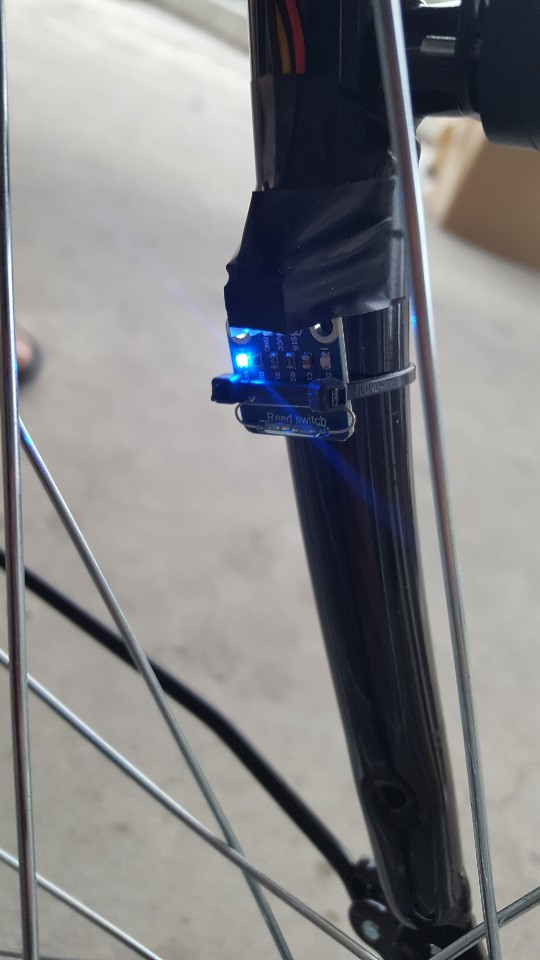
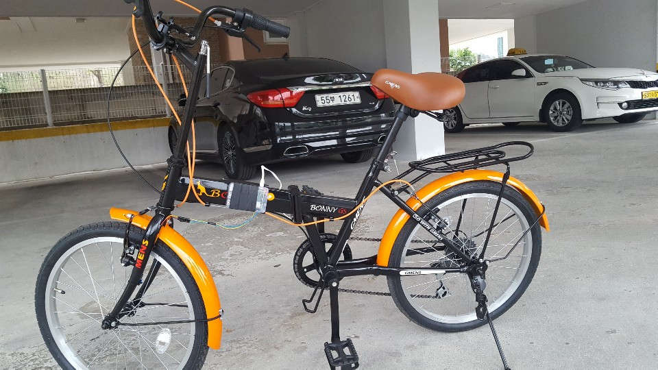
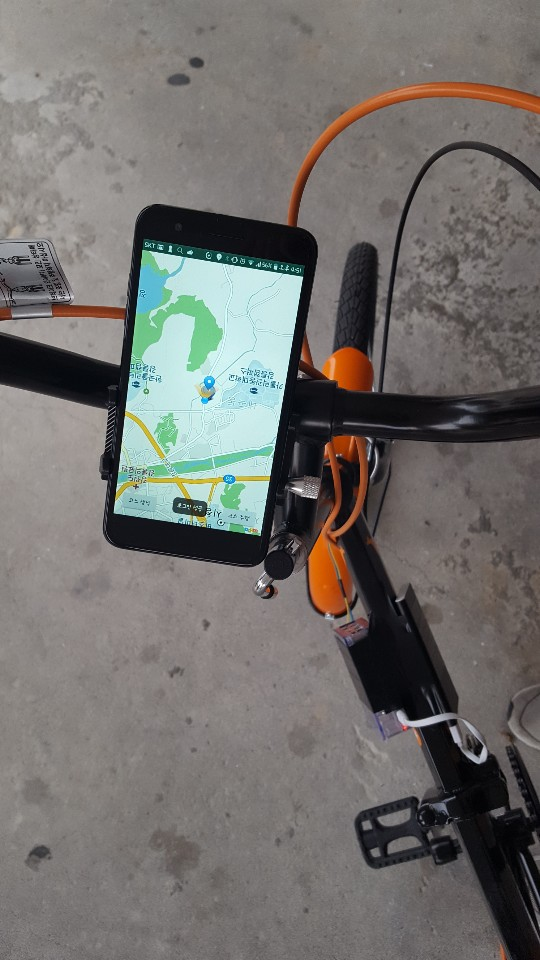
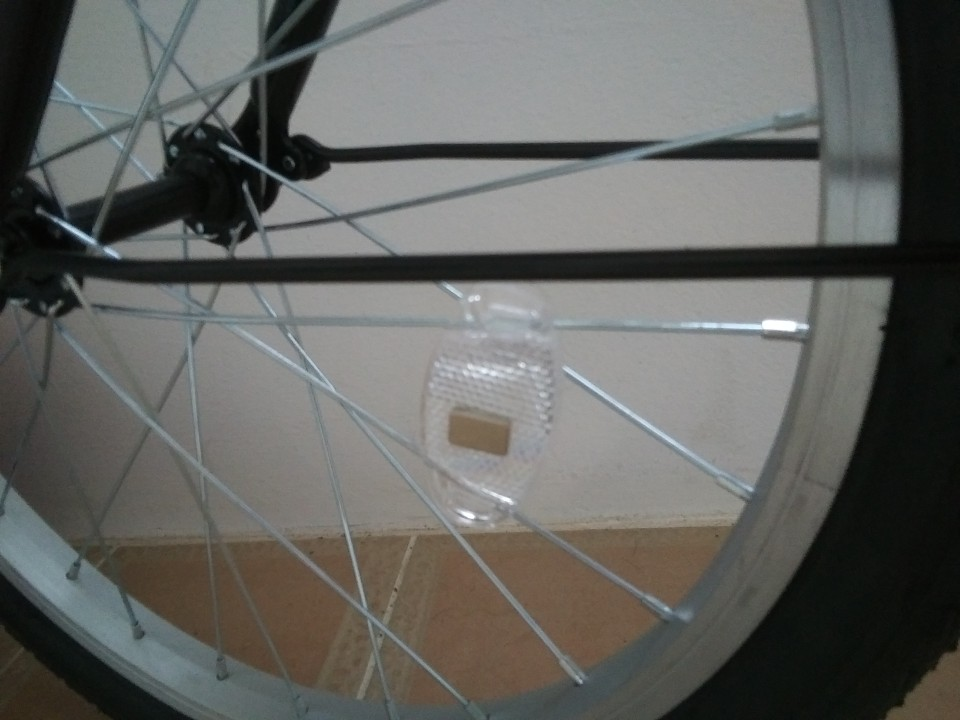

MyApplication
===========
Team 카풀 결과보고서
----------------------
IoT를 활용한 자전거 속도계 시스템
--------------------------------------

### 1. 창업아이디어 배경
*세대별 자전거 보유율(38%)에 반해 현저히 낮은 취미 활동량(6%)을 보이고 점진적으로 개선되고 있는 자전거 주행 환경으로 자전거 대중화 방안 고찰

*기존의 GPS를 활용한 속도 산출 시스템의 문제점 해결 방안 제시
  -GPS가 튀어 속도의 최댓값과 평균값이 천지차이가 남
  
*수치화된 데이터를 통한 경쟁의 긍정적 효과

*경쟁 대상의 실시간 격차 표시

*코스 / 기록 공유를 통한 랭킹 시스템

*리드 스위치를 통한 정확한 속도 측정

### 2. 기능 및 주요내용
*코스 생성
  -다른 사용자들과 경쟁할 코스를 생성하며 생성 완료시 주행 기록 또한 함께 저장됩니다.

*코스 기록 공유
  -‘코스 주행’을 선택 후 지정된 코스의 시작점이 현재 사용자의 위치와 다를 시 다른 코스로 분류되어 선택 대상과 비교 되지 않는다.

*코스 선택
  -기록 보유자의 ID, 속력, 시간이 표시되므로 자신이 원하는 기록을 선택하여 주행한다. 현재 지도상에 모든 코스를 표시하고 다른 사용자와 경쟁을 원할 시 코스 중 원하는 코스에서 주행하면 된다. 사용자의 위치가 선택 코스의 시작점 위치가 아닐 시 주행이 불가능 하다.
  
*속도계
  -라즈베리파이에 리드 스위치를 연동하여 바퀴의 회전수를 모바일에 전송하고 모바일에서는 속도와 주행거리를 산출해 화면에 출력한다.
  
*결과 그래프
  -주행을 마치면 사용자의 기록과 비교 대상의 기록, 사용자의 이전 기록을 총 3개의 꺽은선 그래프를 통해 결과를 알려준다.

### 3. 결과 사진

### 4. 활용방안 및 기대효과
*자전거 코스 주변 자전거 대여점 증가

*자전거 시장 활성화

*앱 사용자 운동량 / 건강 증진

*유명 자전거 코스 기록경쟁 심화

*자전거 안전사고 예방교육 활성화

*실시간 경쟁 기능을 제거하고 AR 구현 예정
  -100m 혹은 200m 구간마다 체크포인트를 설정하여 구간에 비교 대상의 기록을 표시
  
*최초 자전거 어플리케이션에서 AR 구현으로 특허 출원 예정

*라즈베리파이 등 센서를 접목시킨 자전거를 사용함으로 써IOT자전거 특허 출원 예정

### 5. 소감
*팀 과제의 최종 목표는 A가 생성한 코스에 B의 기록이 존재하고, 현재 B가 주행했을 시 주행결과로 A의 기록, B의 이전기록, B의 현재기록이 나오는 것이었다. 최종 목표는 이루었으나 뒤로 가기, 처음위치로 이동 등 불완전한 요소들이 많았다. 그리고 GPS 또한 실내에서는 제약이 많아 정확한 수치를 위해서는 실외에서 끊임없는 테스트를 수행했어야 했다. 여러 테스트 결과 사용자의 현재 위치를 토대로 코스의 시작위치가 아닐시 주행이 불가능하게 했고 코스를 벗어날시 이탈을 표시했다. 

*이 프로젝트를 수행하기 이전엔 어플이나 프로그램을 구현하거나 개발해 본적이 없었다. 처음 프로젝트를 계획했을 시 자료조사와 임무숙지 하는 데만 개발기간의 반 이상을 차지했고 코드를 처음 타이핑 한게 불과 5월 초였다. 라즈베리파이, 앱ui, 알고리즘 등 파트를 정확히 나눠 구현을 시작했고, 5월 말 각자의 소스를 합침으로 써 최종결과물이 서서히 보이기 시작했다. 

*이 결과물은 최종적으로 불완전하지만 처음 개발, 팀 수행, IOT에 있어서 좋은 경험이었다. 
